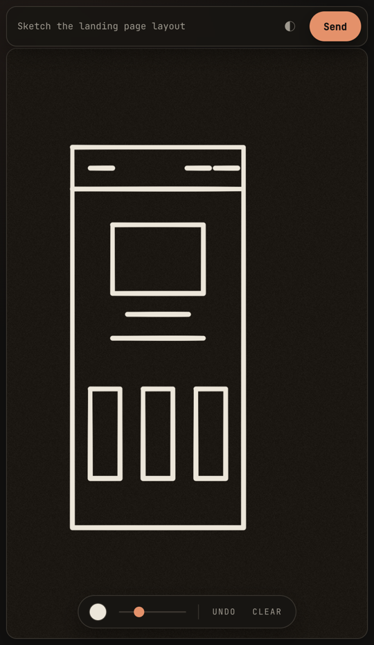
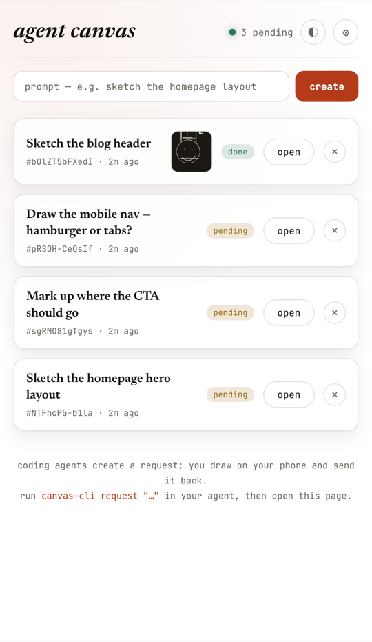
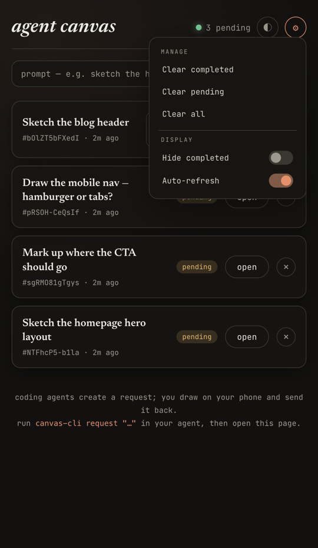

<div align="center">

# 🎨 Agent Canvas

### Your coding agent needs a picture, not a paragraph. Draw it on your phone.



</div>

---

Sometimes words aren't enough. You're working with a command-line coding agent
and you want to say *"put the nav **here**, make the hero **this** shape, line
the cards up like **so**"* — and typing that out is slower and worse than just
**drawing it**.

Agent Canvas lets the agent pop open a drawing pad on your phone. You sketch,
tap **Send**, and your drawing lands right back in the agent's hands as an image
it can actually see.

## How it works

**1. The agent asks for a sketch.**
It runs a single command and gets back a link:

```sh
canvas-cli request "Sketch the landing page layout"
```

**2. You draw it.**
Open the link on your phone. It's a calm paper-and-ink pad — sketch with your
finger or a stylus. Press harder or move slower for a thicker line, just like a
real pen.

**3. You send it.**
Tap **Send**. Your drawing goes straight back to the agent as a picture. The
agent was waiting the whole time, so the moment you hit Send, it has your sketch
and keeps working.

<div align="center">
<table>
<tr>
<td align="center" width="50%">
<br />
<sub><b>Every request in one place</b> — with thumbnails of finished drawings</sub>
</td>
<td align="center" width="50%">
<br />
<sub><b>Tidy up from the ⚙ menu</b> — clear, hide, or filter requests</sub>
</td>
</tr>
</table>
</div>

## Why it's nice

- **A sketch carries intent that's painful to type** — proportions, placement,
  the rough shape of an idea. A ten-second drawing beats a paragraph of
  description.
- **It keeps a human in the loop** for exactly the moments that need one, without
  breaking the agent's flow.
- **The pad opens instantly** — no app to install, no heavy editor. Just a web
  page with a warm paper feel and ink that responds to pressure and speed
  (inspired by [inkwash](https://github.com/johnowhitaker/inkwash)).
- Dark or light (tap ◐), pick an ink colour, change pen size, undo, clear.

## Try it

Run the server:

```sh
go build -o canvas . && ./canvas        # serves on http://localhost:8000
```

Put the helper on your PATH:

```sh
./install                               # symlinks canvas-cli into ~/.local/bin
```

Then, from your agent (or your own shell):

```sh
canvas-cli request "Sketch the homepage"   # prints a link, waits for your drawing
```

That's the whole loop. `canvas-cli` sorts out access on its own — on your dev
box it just talks to the local server; off it, it signs a short-lived token with
the SSH key you already use, so a shared link stays private to you.

## Managing requests

The server's home page is a dashboard of every request, newest first, with
thumbnails of the finished ones. The **⚙ settings menu** lets you clear
completed / pending / all requests, hide the finished ones, or pause
auto-refresh — and every card has an **×** to delete just that one.

---

<div align="center">
<sub>A tiny zero-dependency Go server with a file-backed store · plays nicely behind the <a href="https://exe.dev">exe.dev</a> proxy</sub>
</div>
